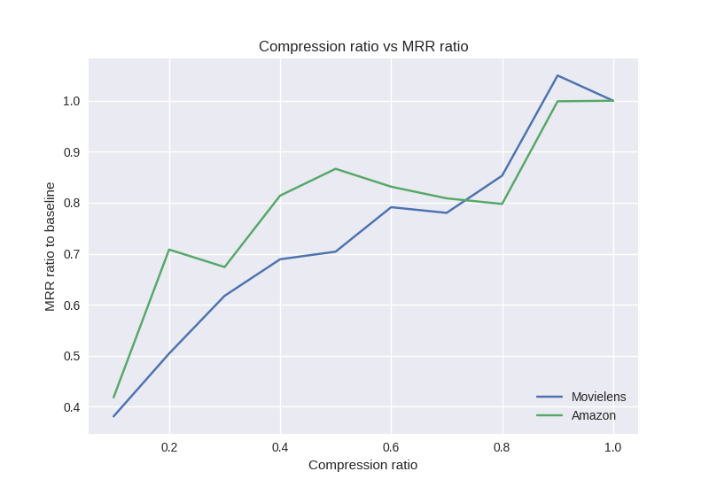
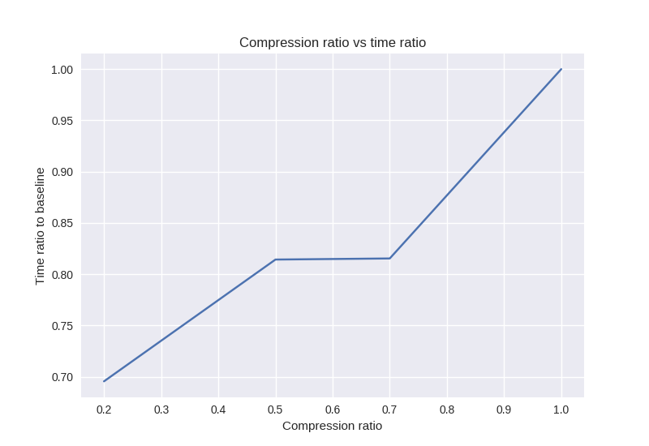

Bloom embedding layers
======================

Large embedding layers are a performance problem for fitting models: even though the gradients are sparse (only a handful of user and item vectors need parameter updates in every minibatch), PyTorch updates the entire embedding layer at every backward pass. Computation time is then wasted on applying zero gradient steps to whole embedding matrix.

To alleviate this problem, we can use a smaller underlying embedding layer, and probabilistically hash users and items into that smaller space. With good hash functions, collisions should be rare, and we should observe fitting speedups without a decrease in accuracy.

The implementation in Spotlight follows the RecSys 2017 "Getting deep recommenders fit: Bloom embeddings for sparse binary input/output networks." `paper <https://arxiv.org/pdf/1706.03993.pdf>`_. In the paper, the authors use the following approach:

1. The input to the model --- a user's interaction history --- is a sparse binary vector, with 1s at indices corresponding to items the user has interacted with and zero otherwise. The dimensionality of that vector (and the corresponding fully-connected layer) is equal to the cardinality of the set of items.
2. To reduce that dimensionality, the authors pick a smaller dimension and hash the original IDs into it. The smaller the resulting vector, the more compact (and faster) the model, at the cost of risking hash collisions (one more than one item is hashed to the same vector indices). To mitigate the impact of hash collisions, each ID is hashed using multiple hash functions, and the corresponding entries are set to 1 while keeping all others at zero.

.. figure:: https://upload.wikimedia.org/wikipedia/commons/thumb/a/ac/Bloom_filter.svg/649px-Bloom_filter.svg.png
   :target: https://en.wikipedia.org/wiki/Bloom_filter
   :align: center

|

Spotlight implementation
------------------------

While the approach in the paper uses binary input vectors, the Spotlight implementation uses embedding layers indexed by hashed indices; vectors retrieved by each hash function are averaged together to yield the final embedding. Mathematically, the two formulations should be identical.

For hashing, I use a simple multiplicative hash with a different prime for every hash function, modulo the size of the compressed embedding layer. The very simple hashing scheme keeps the implementation straightforward, and passes reasonable basic tests of hashing uniformity (the unit test is `here <https://github.com/maciejkula/spotlight/blob/master/tests/test_layers.py>`_; if you have a better idea how to implement basic hashing, let me know!).

Experiments
-----------

To validate the idea (and its implementation), we can run it on a couple of datasets and gauge the effect of embedding on model accuracy.

In this example, I run an experiment on the Movielens 1M dataset. I use sequences of items as inputs, obtain a user representation using an LSTM, and try to predict the next item in the user sequence. I use bloom embedding layers for item representations, at different levels of compression, and compare them to the accuracy obtained using normal embeddings. For each compression level, I carry out a hyperparameter search and pick the hyperparameters that perform best on the test set.

|

|

The hash function used is simple multiplicative hashing with adifferent prime for every hash function, modulo the size of the compressed embedding layer.
