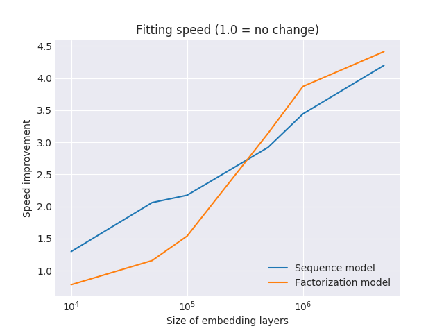

Bloom embedding layers
======================

Large embedding layers are a performance problem for fitting models: even though the gradients are sparse (only a handful of user and item vectors need parameter updates in every minibatch), PyTorch updates the entire embedding layer at every backward pass. Computation time is then wasted on applying zero gradient steps to whole embedding matrix.

To alleviate this problem, we can use a smaller underlying embedding layer, and probabilistically hash users and items into that smaller space. With good hash functions, collisions should be rare, and we should observe fitting speedups without a decrease in accuracy.

The implementation in Spotlight follows the RecSys 2017 "Getting deep recommenders fit: Bloom embeddings for sparse binary input/output networks." `paper <https://arxiv.org/pdf/1706.03993.pdf>`_. In the paper, the authors use the following approach:

1. The input to the model --- a user's interaction history --- is a sparse binary vector, with 1s at indices corresponding to items the user has interacted with and zero otherwise. The dimensionality of that vector (and the corresponding fully-connected layer) is equal to the cardinality of the set of items.
2. To reduce that dimensionality, the authors pick a smaller dimension and hash the original IDs into it. The smaller the resulting vector, the more compact (and faster) the model, at the cost of risking hash collisions (one more than one item is hashed to the same vector indices). To mitigate the impact of hash collisions, each ID is hashed using multiple hash functions, and the corresponding entries are set to 1 while keeping all others at zero.

.. figure:: https://upload.wikimedia.org/wikipedia/commons/thumb/a/ac/Bloom_filter.svg/649px-Bloom_filter.svg.png
   :target: https://en.wikipedia.org/wiki/Bloom_filter
   :align: center

|

Spotlight implementation
------------------------

While the approach in the paper uses binary input vectors, the Spotlight implementation uses embedding layers indexed by hashed indices; vectors retrieved by each hash function are averaged together to yield the final embedding. Mathematically, the two formulations should be identical. However, we can expect different fitting speed gains. In the original formulation (using high-dimensional dense matrix-vector multiplications) the cost of high dimensionality is borne twice: firstly, in having to update all the parameters on every gradient step, and, secondly, in having to perform the full multiplication. This is wasteful because the vast majority of the entries in the matrix are zeros. The Spotlight implementation uses embedding layers, which do not incur the cost of needless matrix multiplication, and so we will not see that part of the performance gain. Additionally, the models in the paper seem to be predominantly trained with a softmax loss, making predictions for all items in one go during training. In contrast, Spotlight uses `negative sampling <http://ruder.io/word-embeddings-softmax/index.html#negativesampling>`_ during training, and one-by-one predictions at prediction time. In this implementation, bloom embeddings offer no performance advantages at prediction time.

(It would be interesting to compare the two approaches to user and item representation. However, this is beyond the scope of this post.)

For hashing, I used the murmurhash3 hash function family, hashing the indices with a different seed for every hash function, modulo the size of the compressed embedding layer. The hash mapping is computed once at the start of training, and indexed into for every minibatch.

Experiments: fitting speed
--------------------------

Improvements in fitting speed materialise only when the embedding dimension is high. The plot below shows the relative improvement in fitting time of a bloom embedding layer, assuming compression ratio of 0.2 and 4 hash functions. To get the timings, I run a factorization and a sequence model on the Movielens 100K dataset, artificially inflating the number of users and items.

|

The performance gains increase as the embedding dimension grows large; for small dimensionalities, bloom embeddings are slower, presumably due to hashing and averaging overhead. They are also larger for factorization models: sequence models only have one embedding layer (items).

Performance gains diminish as the number of hash functions increases, and as the compression ratio goes to 1.0.

Experiments: accuracy
---------------------

To validate the idea (and its implementation), we can run it on a real datasets and gauge the effect of embedding on model accuracy and speed.

To get a better feel for the performance of the bloom embedding layers, I run experiments on two datasets that differ in their dimensionality and degree of sparsity:

- Movielens 1M: a classic dense dataset, with relatively few items and users (around 6000 users and 4000 items).
- Amazon dataset: data on Amazon products from the SNAP `archive <https://snap.stanford.edu/data/amazon-meta.html>`_. The dataset contains almost 8 million ratings given to 550,000 Amazon products: interactions represent ratings given to users to products they have reviewed. Compared to the Movielens dataset, the Amazon dataset is relatively sparse, and the number of products represented is much higher. It may therefore be more representative of the types of problems where bloom embeddings are useful.

I use LSTM-based sequence prediction models for both datasets: I obtain a user representation from a user's interaction history using an LSTM, and try to predict the next item in the user sequence. I use bloom embedding layers for item representations, at different levels of compression, and compare them to the accuracy obtained using normal embeddings. The model hyperparameters are set using a hyperparameter search that optimizes the accuracy of standard embedding model.

.. image:: plot.png
   :align: center

|

.. image:: time.png
   :align: center

|
